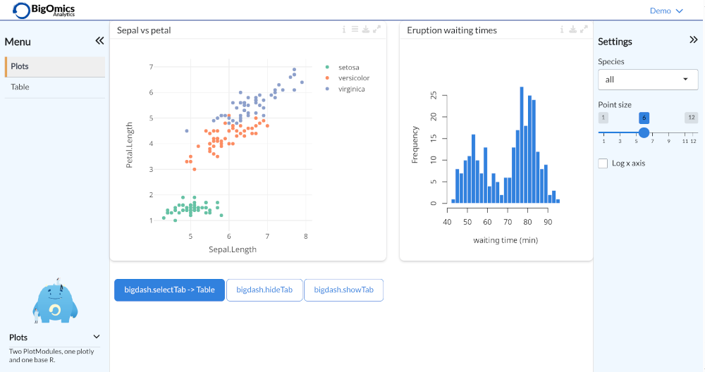

<!-- badges: start -->
<!-- badges: end -->

# bigdash

[Shiny](https://shiny.rstudio.com) dashboard layout and theme for Omics Playground. 

## Installation

You can install the development version of bigdash from [GitHub](https://github.com/) with:

``` r
# install.packages("remotes")
remotes::install_github("bigomics/bigdash")
```

## Examples

For code examples, see folder [inst/examples](inst/examples)



